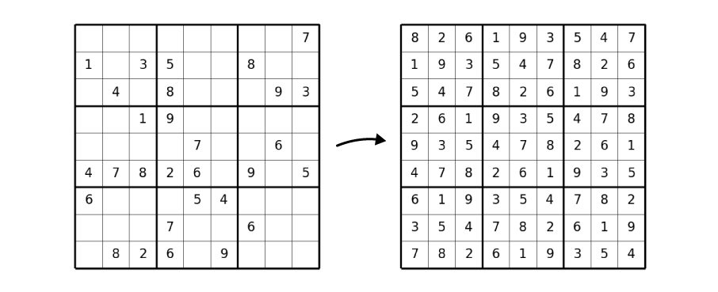

# Sudoku Generator and Solver

Run `python main.py` in the terminal and a small 9x9 Sudoku will be generated then solved using a [backtracking algorithm](https://en.wikipedia.org/wiki/Sudoku_solving_algorithms).

### ✨ Main Features
+ `sudoku.fill()` to fill an empty grid with numbers that follow the rules of Sudoku.
+ `sudoku.delete()` to randomly delete numbers out of the grid to turn it into a puzzle.
+ `sudoku.show()` to display the sudoku visually using [matplotlib]() just like in the image above.
+ `sudoku.save_text()` to save a sudoku as a text file.
---
+ `solver.solve_sudoku()` to find the solution for a given Sudoku.